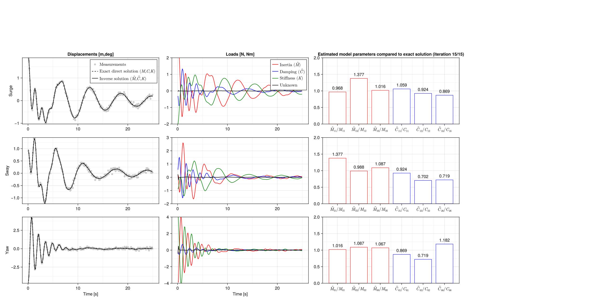

```@meta
EditURL = "../../examples/DecayAnalysis.jl"
```

# Estimating model parameters

We estimate the mass and damping matrices of a coupled linear oscillator (floater moving in the surge, sway and yaw) based on a decay tests
In the following, we define the necessary element and residual function describing the dynamic behaviour of the floater.

NB: In two places in this script, `solve` is called with optional `verbose=false`, because this script is part of the generation
of `Muscade`'s online documentation.  Setting `verbose=true` would be more relevant in other contexts.

````@example DecayAnalysis
using Muscade,StaticArrays,Interpolations,GLMakie

fold(x::SVector{6}) = SMatrix{3,3}( x[1],x[2],x[3],
                                    x[2],x[4],x[5],
                                    x[3],x[5],x[6])

const floatermotion  = (:surge,:sway,:yaw)
const idx    = (:11,:12,:16,:22,:26,:66)

struct FloaterOnCalmWater <: AbstractElement
    K   :: SMatrix{3,3,𝕣}
    C   :: SMatrix{3,3,𝕣}
    M   :: SMatrix{3,3,𝕣}
end
FloaterOnCalmWater(nod::Vector{Node};K,C,M  )  = FloaterOnCalmWater(K,C,M)

Muscade.no_second_order(::Type{<:FloaterOnCalmWater}) = Val(true)

Muscade.doflist(::Type{<:FloaterOnCalmWater}) = (inod  = (ntuple(i-> 1,3)...,ntuple(i-> 1,3)...,ntuple(i-> 1,6)...,                  ntuple(i-> 1,6)...           ),
                                                 class = (ntuple(i->:X,3)...,ntuple(i->:U,3)...,ntuple(i->:A,6)...,                  ntuple(i->:A,6)...          ),
                                                 field = (floatermotion...  ,floatermotion...  ,ntuple(i->Symbol(:M,idx[i]),6)...,   ntuple(i->Symbol(:C,idx[i]),6)...))

@espy function Muscade.residual(o::FloaterOnCalmWater,   X,U,A,t,SP,dbg)
    x,x′,x″    = ∂0(X),∂1(X),∂2(X)
    ☼u         = ∂0(U)
    a          = exp10.(A)
    ☼r₂        = (o.M.*fold(a[@SVector [i for i∈1:6 ]]))∘₁x″
    ☼r₁        = (o.C.*fold(a[@SVector [i for i∈7:12]]))∘₁x′
    ☼r₀        = o.K∘₁x
    return r₀+r₁+r₂-u,  noFB
end
````

This is a tailor-made cost element where the cost is made dependent on the iteration number. In practice, this is used to first solve an XU problem (costs on A are prohibitive) before solving the actual XUA problem.

````@example DecayAnalysis
struct SingleDecayAcost{Field,Tcost,Tcostargs} <: AbstractElement
    cost     :: Tcost
    costargs :: Tcostargs
    fac      :: 𝕣1
end

SingleDecayAcost(nod::Vector{Node};field::Symbol,fac,cost::Functor ,costargs=()) = SingleDecayAcost{field,typeof(cost),typeof(costargs)}(cost,costargs,fac)
Muscade.doflist(::Type{<:SingleDecayAcost{Field,Tcost,Tcostargs}}) where{Field,Tcost,Tcostargs} = (inod=(1,),class=(:A,),field=(Field,))
@espy function Muscade.lagrangian(o::SingleDecayAcost,Λ,X,U,A,t,SP,dbg)
    iter  = min(length(o.fac),default{:iter}(SP,length(o.fac)))
    ☼cost = o.cost(    A[1]  ,o.costargs...)
    return cost*o.fac[iter],noFB
end
````

Define stiffness, damping and mass matrix for the true system

````@example DecayAnalysis
K         = fold(SVector{6}([1.0,    0.0,     0.0,     1.0,    0.0,     1.0]))
C         = fold(SVector{6}([0.25,   -0.2,     0.1,     0.15,   -0.15,     0.03]))
M         = fold(SVector{6}([1.0,    0.1,     0.2,     0.5,     0.1,     0.1]));
nothing #hide
````

Solve direct problem

````@example DecayAnalysis
model     = Model(:MooredFloater)
n1        = addnode!(model,𝕣[0,0,0])
e1        = addelement!(model,FloaterOnCalmWater,[n1]; K,C,M)
initialstate    = initialize!(model;time=0.)
initialstate    = setdof!(initialstate,[2.0];   field=:surge,   nodID=[n1], order=0)
initialstate    = setdof!(initialstate,[1.0];    field=:sway,    nodID=[n1], order=0)
initialstate    = setdof!(initialstate,[-5.0];  field=:yaw,     nodID=[n1], order=0)
T               = 0.1 *(1:250)
state           = solve(SweepX{2};  initialstate,time= T,verbose=false);
surge   = [s.X[1][1] for s∈state]
sway    = [s.X[1][2] for s∈state]
yaw     = [s.X[1][3] for s∈state];
nothing #hide
````

Create fake measurements

````@example DecayAnalysis
surgeMeas = surge   + .05 * randn(length(T))
swayMeas = sway     + .05 * randn(length(T))
yawMeas = yaw       + .1 * randn(length(T));
nothing #hide
````

Create intial guesses for M and C

````@example DecayAnalysis
Cguess         = fold(SVector{6}([0.1,   -0.1,     0.1,     0.1,   -0.1,     0.1]))
Mguess         = fold(SVector{6}([1.0,    1.0,     1.0,     1.0,    1.0,     1.0]));
nothing #hide
````

Create XUA model

````@example DecayAnalysis
modelXUA  = Model(:MooredFloater)
n1        = addnode!(modelXUA,𝕣[0,0,0])
e1        = addelement!(modelXUA,FloaterOnCalmWater,[n1]; K,C=Cguess,M=Mguess);
nothing #hide
````

Assign costs to unknown forces

````@example DecayAnalysis
Quu       = @SVector [0.05 ^-2 for i=1:3 ]
@functor with(Quu) cost1(u,t,i) = 0.5*Quu[i]*u^2
e2        = [addelement!(modelXUA,SingleDofCost     ,[n1]; class=:U,field=f           ,    cost=cost1,costargs=(i,))  for (i,f)∈enumerate(floatermotion)];
nothing #hide
````

Assign costs to variations of model parameters (wrt guess).

````@example DecayAnalysis
fac       = [256,128,64,32,16,8,4,2,1]
QCaa      = @SVector [.1 ^-2 for i=1:6 ]
@functor with(QCaa,T) cost2(a,i) = 0.5*QCaa[i]/length(T)*a^2
e3        = [addelement!(modelXUA,SingleDecayAcost  ,[n1];          field=f,fac,           cost=cost2,costargs=(i,)) for (i,f)∈enumerate((:C11,:C12,:C16,:C22,:C26,:C66))]
QMaa      = @SVector [.1 ^-2 for i=1:6 ]
@functor with(QMaa,T) cost3(a,i) = 0.5*QMaa[i]/length(T)*a^2
e4        = [addelement!(modelXUA,SingleDecayAcost  ,[n1];          field=f,fac,           cost=cost3,costargs=(i,)) for (i,f)∈enumerate((:M11,:M12,:M16,:M22,:M26,:M66))];
nothing #hide
````

Assign costs to measurement errors

````@example DecayAnalysis
surgeInt    = linear_interpolation(T, surgeMeas)
swayInt     = linear_interpolation(T, swayMeas)
yawInt      = linear_interpolation(T, yawMeas)
@functor with(surgeInt) devSurge(surge,t)     = 1e-1 ^-2 * (surge-surgeInt(t))^2
@functor with(swayInt ) devSway(sway,t)       = 1e-1 ^-2 * (sway-swayInt(t))^2
@functor with(yawInt  ) devYaw(yaw,t)         = 1e-1 ^-2 * (yaw-yawInt(t))^2
e5             = addelement!(modelXUA,SingleDofCost,[n1];class=:X,field=:surge,    cost=devSurge)
e6             = addelement!(modelXUA,SingleDofCost,[n1];class=:X,field=:sway,     cost=devSway)
e7             = addelement!(modelXUA,SingleDofCost,[n1];class=:X,field=:yaw,      cost=devYaw);


#Solve inverse problem
initialstateXUA    = initialize!(modelXUA;time=0.)
stateXUA         = solve(DirectXUA{2,0,1};initialstate=[initialstateXUA],time=[T],
                        maxiter=100,saveiter=true,verbose=false,
                        maxΔx=1e-5,maxΔλ=Inf,maxΔu=1e-5,maxΔa=1e-5);
nothing #hide
````

Fetch and display estimated model parameters

````@example DecayAnalysis
lastIter = findlastassigned(stateXUA); niter = lastIter; iexp=1;
Mest      = Mguess .* fold(exp10.(SVector{6}(stateXUA[niter][iexp][1].A[1:6 ])))
Cest      = Cguess .* fold(exp10.(SVector{6}(stateXUA[niter][iexp][1].A[7:12])));
nothing #hide
````

Fetch response and loads

````@example DecayAnalysis
surgeRec    = [s.X[1][1] for s∈stateXUA[niter][iexp]]
swayRec     = [s.X[1][2] for s∈stateXUA[niter][iexp]]
yawRec      = [s.X[1][3] for s∈stateXUA[niter][iexp]]
surgeExtF   = [s.U[1][1] for s∈stateXUA[niter][iexp]]
swayExtF    = [s.U[1][2] for s∈stateXUA[niter][iexp]]
yawExtF     = [s.U[1][3] for s∈stateXUA[niter][iexp]]
req = @request r₂,r₁,r₀
loads = getresult(stateXUA[niter][iexp],req,[e1])
inertiaLoads = [loads[i][:r₂] for i∈1:length(T)]
dampingLoads = [loads[i][:r₁] for i∈1:length(T)]
stiffnessLoads = [loads[i][:r₀] for i∈1:length(T)];
nothing #hide
````

Create a figure with the results

````@example DecayAnalysis
fig      = Figure(size = (2000,1000));
nothing #hide
````

Display response

````@example DecayAnalysis
ax=Axis(fig[1,1], ylabel="Surge", yminorgridvisible = true,xminorgridvisible = true)
scatter!(fig[1,1],T,surgeMeas, color=RGBf(.8, .8, .8),        label=L"\text{Measurements}")
lines!(fig[1,1],T,surge,       color=:black, linestyle=:dash, label=L"\text{Exact direct solution } (M,C,K)")
lines!(fig[1,1],T,surgeRec,    color=:black,                  label=L"\text{Inverse solution } (\hat{M},\hat{C},K)")
ylims!(ax,minimum(surgeMeas),maximum(surgeMeas))
ax.title="Displacements [m,deg]"
axislegend()

ax=Axis(fig[2,1], ylabel="Sway", yminorgridvisible = true,xminorgridvisible = true)
scatter!(fig[2,1],T,swayMeas,   color=RGBf(.8, .8, .8))
lines!(fig[2,1],T,sway,         color=:black, linestyle=:dash)
ylims!(ax,-1,2)
lines!(fig[2,1],T,swayRec,      color=:black)
ylims!(ax,minimum(swayMeas),maximum(swayMeas))

ax=Axis(fig[3,1], ylabel="Yaw", yminorgridvisible = true,xminorgridvisible = true,xlabel="Time [s]")
scatter!(fig[3,1],T,yawMeas,    color=RGBf(.8, .8, .8))
lines!(fig[3,1],T,yaw,          color=:black, linestyle=:dash)
lines!(fig[3,1],T,yawRec,       color=:black)
ylims!(ax,minimum(yawMeas),maximum(yawMeas))
````

Display loads

````@example DecayAnalysis
ax=Axis(fig[1,2], yminorgridvisible = true,xminorgridvisible = true)
lines!(fig[1,2],T,-[inertiaLoads[i][1] for i∈1:length(T)],  color=:red,     label=L"\text{Inertia } (\hat{M})")
lines!(fig[1,2],T,-[dampingLoads[i][1] for i∈1:length(T)],  color=:blue,    label=L"\text{Damping } (\hat{C})")
lines!(fig[1,2],T,-[stiffnessLoads[i][1] for i∈1:length(T)],color=:green,   label=L"\text{Stiffness } (K)")
lines!(fig[1,2],T,surgeExtF,                                color=:black,   label=L"\text{Unknown}")
ax.title="Loads [N, Nm]"
ylims!(ax,-2,2)
axislegend()

ax=Axis(fig[2,2], yminorgridvisible = true,xminorgridvisible = true)
lines!(fig[2,2],T,-[inertiaLoads[i][2] for i∈1:length(T)],      color=:red  )
lines!(fig[2,2],T,-[dampingLoads[i][2] for i∈1:length(T)],      color=:blue )
lines!(fig[2,2],T,-[stiffnessLoads[i][2] for i∈1:length(T)],    color=:green)
lines!(fig[2,2],T,swayExtF,                                     color=:black)
ylims!(ax,-2,3)

ax=Axis(fig[3,2], yminorgridvisible = true,xminorgridvisible = true,xlabel="Time [s]")
lines!(fig[3,2],T,-[inertiaLoads[i][3] for i∈1:length(T)],      color=:red  )
lines!(fig[3,2],T,-[dampingLoads[i][3] for i∈1:length(T)],      color=:blue)
lines!(fig[3,2],T,-[stiffnessLoads[i][3] for i∈1:length(T)],    color=:green)
lines!(fig[3,2],T,yawExtF,                                      color=:black)
ylims!(ax,-4,4)

ax=Axis(fig[1,3], limits=(nothing,nothing,0,2),
    xticks = (1:6, [L"\hat{M}_{11}/M_{11}", L"\hat{M}_{12}/M_{12}", L"\hat{M}_{16}/M_{16}",L"\hat{C}_{11}/C_{11}", L"\hat{C}_{12}/C_{12}", L"\hat{C}_{16}/C_{16}"]),
    yminorgridvisible = true,xminorgridvisible = true)
barplot!(ax,[1,2,3,4,5,6], [Mest[1,1]/M[1,1],Mest[1,2]/M[1,2],Mest[1,3]/M[1,3], Cest[1,1]/C[1,1],Cest[1,2]/C[1,2],Cest[1,3]/C[1,3]],
    bar_labels = :y,color=:white,strokewidth=1,strokecolor=[:red,:red,:red,:blue,:blue,:blue])
ax.title="Estimated model parameters compared to exact solution (iteration " * string(niter) * "/" * string(lastIter) * ")"

ax=Axis(fig[2,3], limits=(nothing,nothing,0,2),
    xticks = (1:6, [L"\hat{M}_{21}/M_{21}", L"\hat{M}_{22}/M_{22}", L"\hat{M}_{26}/M_{26}",L"\hat{C}_{21}/C_{21}", L"\hat{C}_{22}/C_{22}", L"\hat{C}_{26}/C_{26}"]),
    yminorgridvisible = true,xminorgridvisible = true)
barplot!(ax,[1,2,3,4,5,6], [Mest[2,1]/M[2,1],Mest[2,2]/M[2,2],Mest[2,3]/M[2,3], Cest[2,1]/C[2,1],Cest[2,2]/C[2,2],Cest[2,3]/C[2,3]],
    bar_labels = :y,color=:white,strokewidth=1,strokecolor=[:red,:red,:red,:blue,:blue,:blue])

ax=Axis(fig[3,3], limits=(nothing,nothing,0,2),
    xticks = (1:6, [L"\hat{M}_{61}/M_{61}", L"\hat{M}_{62}/M_{62}", L"\hat{M}_{66}/M_{66}",L"\hat{C}_{61}/C_{61}", L"\hat{C}_{62}/C_{62}", L"\hat{C}_{66}/C_{66}"]),
    yminorgridvisible = true,xminorgridvisible = true)
barplot!(ax,[1,2,3,4,5,6], [Mest[3,1]/M[3,1],Mest[3,2]/M[3,2],Mest[3,3]/M[3,3], Cest[3,1]/C[3,1],Cest[3,2]/C[3,2],Cest[3,3]/C[3,3]],
    bar_labels = :y,color=:white,strokewidth=1,strokecolor=[:red,:red,:red,:blue,:blue,:blue])

currentDir = @__DIR__
if occursin("build", currentDir)
    save(normpath(joinpath(currentDir,"..","src","assets","decay.png")),fig)
elseif occursin("examples", currentDir)
    save(normpath(joinpath(currentDir,"decay.png")),fig)
end
````



---

*This page was generated using [Literate.jl](https://github.com/fredrikekre/Literate.jl).*

