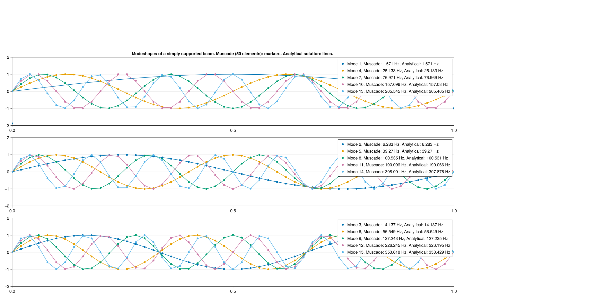

```@meta
EditURL = "../../examples/ModalBeamAnalysis.jl"
```

# Modal analysis of a beam

Beam simply supported at both ends

````@example ModalBeamAnalysis
using Muscade, StaticArrays, GLMakie
using Muscade.Toolbox

L = 1.;  # Beam length [m]
q = 0.0;  # Uniform lateral load [N/m]
EI₂ = 1.;  # Bending stiffness [Nm²]
EI₃ = 1.;  # Bending stiffness [Nm²]
EA = 1e6;  # Axial stiffness [N]
GJ = 1e6;  # Torsional stiffness [Nm²]
μ = 1.;
ι₁= 1.;
nothing #hide
````

Create model

````@example ModalBeamAnalysis
nel         = 50
Nnod        = nel+1
nodeCoord   = hcat((0:L/nel:L),zeros(Float64,Nnod,2))
mat         = BeamCrossSection(EA=EA,EI₂=EI₂,EI₃=EI₃,GJ=GJ,μ=μ,ι₁=ι₁)
model       = Model(:TestModel)
nodid       = addnode!(model,nodeCoord)
mesh        = hcat(nodid[1:Nnod-1],nodid[2:Nnod])
eleid       = addelement!(model,EulerBeam3D,mesh;mat=mat,orient2=SVector(0.,1.,0.));
nothing #hide
````

Set boundary conditions and constraints

````@example ModalBeamAnalysis
[addelement!(model,Hold,[nodid[1]]  ;field) for field∈[:t1,:t2,:t3,:r1]]                                # Simply supported end 1
[addelement!(model,Hold,[nodid[end]];field) for field∈[:t1,:t2,:t3,:r1]]                                # Simply supported end 2
[addelement!(model,Hold,[nodid[nodeidx]];field=:t3) for nodeidx∈2:Nnod-1]                               # Enforce beam motions in one dimension to obtain planar modeshapes
@functor with(q,L,Nnod) val(t) = sin(t)*q*L/Nnod
[addelement!(model,DofLoad,[nodid[nodeidx]];field=:t2,value=val) for nodeidx=1:Nnod];    # Distributed vertical load q
nothing #hide
````

Static analysis

````@example ModalBeamAnalysis
initialstate    = initialize!(model);
state           = solve(SweepX{0};initialstate,time=[0.]);
nothing #hide
````

Solve eigenvalue problem

````@example ModalBeamAnalysis
nmod            = 15
res             = solve(EigX{ℝ};state=state[1],nmod);
nothing #hide
````

Analytical solutions for the natural frequency of a simply supported beam
See e.g. https://roymech.org/Useful_Tables/Vibrations/Natural_Vibrations_derivation.html

````@example ModalBeamAnalysis
fₙ(k) = √(EI₂/μ)*(k^2*π)/(2*L^2)
Φₙ(k,x) = sin.(k*π/L.*x);
nothing #hide
````

Display solution and comparison against analytical solution

````@example ModalBeamAnalysis
fig      = Figure(size = (2000,1000))
axes = [Axis(fig[idxLine,1], yminorgridvisible = false,xminorgridvisible = false ) for idxLine=1:3]
axes[1].title = "Modeshapes of a simply supported beam. Muscade (" *string(nel)*" elements): markers. Analytical solution: lines. "
for idxMod=1:nmod
    eigres  = increment(state[1],res,[idxMod],[1]);
    t2_eig  = getdof(eigres;field=:t2,nodID=nodid[1:Nnod])
    δ       = sign(Φₙ(idxMod,0:L/nel:L)'*t2_eig) * maximum(t2_eig)
    selectAxis = axes[mod(idxMod-1,3)+1]
    labelStr= "Mode "*string(idxMod)*", Muscade: "*string(round(res.ω[idxMod]/(2π),digits=3))*" Hz, Analytical: " *string(round(fₙ(idxMod),digits=3))* " Hz"
    scatter!(selectAxis,(0:L/nel:L),  t2_eig[:]/δ,          label=labelStr  );
    lines!(  selectAxis,(0:L/nel:L),  Φₙ(idxMod,0:L/nel:L)                  );
end
for ax∈axes;
    xlims!(ax,0,1); ylims!(ax, -2,2); axislegend(ax)
end

currentDir = @__DIR__
if occursin("build", currentDir)
    save(normpath(joinpath(currentDir,"..","src","assets","beamModes.png")),fig)
elseif occursin("examples", currentDir)
    save(normpath(joinpath(currentDir,"beamModes.png")),fig)
end
````



---

*This page was generated using [Literate.jl](https://github.com/fredrikekre/Literate.jl).*

