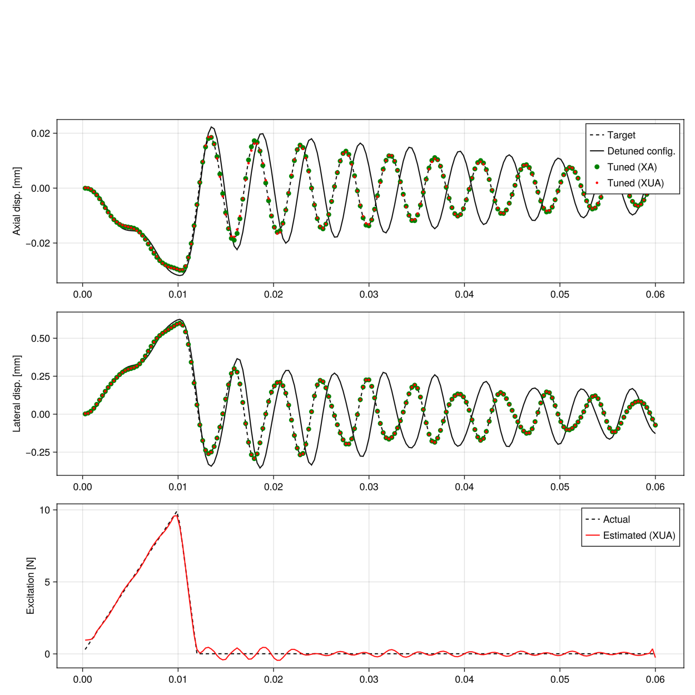

```@meta
EditURL = "../../examples/TuningFork.jl"
```

# Tuning vibrations of a tuning fork

Tuning forks should resonate at a desired frequency when subjected to an impulsive load. Achieving the right frequency cab be done by adding material or filing material off the prongs.
We start from a target solution establihed using SweepX. A sprious mass is then introduced, parametrized by an A-dof. We use the SweepXA and DirectXUA solvers to estimate how much mass should be removed. In SweepXA, the excitation is assume to be known, while it is estimated by DirectXUA.

NB: In several places in this script, `solve` is called with optional `verbose=false`, because this script is part of the generation
of `Muscade`'s online documentation.  Setting `verbose=true` would be more relevant in other contexts.

````@example TuningFork
using Muscade, StaticArrays, GLMakie, Muscade.Toolbox
````

Dimensions of the tuning fork and number of elements

````@example TuningFork
l₀=2.5e-2;  n₀=1    # base - length and number of elements
l₁=1e-2;    n₁=1    # fork - length and number of elements per side
l₂=9.5e-2;  n₂=5    # prong - length and number of elements per side
b = 5e-3;           # thickness of the cross-section
E = 210e9;          # Young modulus
G = 79.3e9;         # shear modulus
μ = 7850. *b^2;     # mass per unit length, assumes steel
beamCrossSection = BeamCrossSection(EA=E*b^2, EI₂=1/12*E*b^4, EI₃=1/12*E*b^4, GJ=1/3*G*b^4, μ=μ, ι₁=1/6*μ*b^2,Cl₂=10.,Cl₃=10.);
nothing #hide
````

Define an A-parametrized point mass element (inducing an inertia force)

````@example TuningFork
struct LumpedMass <: AbstractElement; m :: 𝕣; end
LumpedMass(nod::Vector{Node};m::𝕣) = LumpedMass(m)
@espy function Muscade.residual(o::LumpedMass, X,U,A, t,SP,dbg); return (o.m+A[1]).*∂2(X),noFB; end
Muscade.doflist( ::Type{LumpedMass})  = (inod =(1,1,1,2), class=(:X,:X,:X,:A), field=(:t1,:t2,:t3,:mass));
nothing #hide
````

Time step and simulation length settings

````@example TuningFork
Δt                = 3e-4;
nDynamicLoadSteps = 200;
timeVec           = Δt:Δt:nDynamicLoadSteps*Δt;
nothing #hide
````

Coordinates of the nodes.

````@example TuningFork
XnodeCoord = vcat(
    hcat((0:n₀) * l₀/n₀     , zeros(n₀+1,1) , zeros(n₀+1,1) ), # base nodes
    hcat(ones(n₁,1)*l₀      , (1:n₁)*l₁/n₁  , zeros(n₁,1)   ), # upper fork
    hcat(ones(n₁,1)*l₀      , -(1:n₁)*l₁/n₁ , zeros(n₁,1)   ), # lower fork
    hcat(l₀ .+ (1:n₂)*l₂/n₂ , ones(n₂,1)*l₁ , zeros(n₂,1)   ), # upper prong
    hcat(l₀ .+ (1:n₂)*l₂/n₂ , -ones(n₂,1)*l₁, zeros(n₂,1)   )  # lower prong
)
````

External excitation load at the end of the upper prong

````@example TuningFork
@functor with() pling(t) = Muscade.FunctionFromVector([-10, 0, 10e-3, 12e-3, 10],[0,0,10,0,0])(t)
plingNode = n₀+2n₁+n₂+1; # where do we hit the tuning fork
nothing #hide
````

# Building the model

````@example TuningFork
model       = Model(:TuningFork);
nothing #hide
````

Add the nodes describing the beam model, the node that will contain the parameter to optimize

````@example TuningFork
Xnod = addnode!(model,XnodeCoord)
Anod = addnode!(model,𝕣[])
````

List of nodes that will be used to create the beam elements

````@example TuningFork
nel = n₀+2n₁+2n₂
mesh = vcat(
    hcat(Xnod[1:n₀],Xnod[2:n₀+1]),                                                                              # base
    hcat(Xnod[n₀+1:n₀+n₁],Xnod[n₀+2:n₀+n₁+1]),                                                                  # upper fork
    [Xnod[n₀+1] Xnod[n₀+n₁+2]],         hcat(Xnod[n₀+n₁+2:n₀+2n₁],Xnod[n₀+n₁+3:n₀+2n₁+1])           ,           # lower fork
    [Xnod[n₀+n₁+1] Xnod[n₀+2n₁+2]],     hcat(Xnod[n₀+2n₁+2:n₀+2n₁+n₂],Xnod[n₀+2n₁+3:n₀+2n₁+n₂+1])   ,           # upper prong
    [Xnod[n₀+2n₁+1] Xnod[n₀+2n₁+n₂+2]], hcat(Xnod[n₀+2n₁+n₂+2:n₀+2n₁+2n₂],Xnod[n₀+2n₁+n₂+3:n₀+2n₁+2n₂+1])       # lower prong
)
````

In the XUA analysis we estimate the distributed load on the element close to the node where the load was applied

````@example TuningFork
plingElement = n₀+2n₁+n₂;
nothing #hide
````

Add beam elements to the model, enabling Udof only for the element that is hit.

````@example TuningFork
addelement!(model,EulerBeam3D{false}, mesh;             mat=beamCrossSection,orient2=SVector(0.,0,1))
[addelement!(model,Hold,[Xnod[1]]  ;field)  for field∈[:t1,:t2,:t3,:r1,:r2,:r3]];
nothing #hide
````

# Create variations of the model

````@example TuningFork
XAmodel =   deepcopy(model)
XUAmodel =  deepcopy(model);
nothing #hide
````

Add parasitic lump mass on both XA and XUA models

````@example TuningFork
spuriousMass = 4e-3;
spuriousMassLocation = plingNode-1
addelement!(XAmodel,  LumpedMass, [Xnod[spuriousMassLocation] Anod]; m=spuriousMass)
addelement!(XUAmodel, LumpedMass, [Xnod[spuriousMassLocation] Anod]; m=spuriousMass);
nothing #hide
````

Add known external force to X and XA models, and an unknown force to XUA model

````@example TuningFork
addelement!(model,    DofLoad,[Xnod[plingNode]];field=:t2,value=pling)
addelement!(XAmodel,  DofLoad,[Xnod[plingNode]];field=:t2,value=pling);
@functor with(σᵤₚ=0.1) UcostPling(u,t) = 0.5*(u/σᵤₚ)^2 * clutch(t,0.02,0.04,1.,100.,1)
addelement!(XUAmodel, SingleUdof,[Xnod[plingNode]];Xfield=:t2,Ufield=:t2,cost=UcostPling)
````

Establish target response

````@example TuningFork
initialState    = initialize!(model;time=0.);
dynamicStates   = solve(SweepX{2};initialstate=initialState, time=timeVec, verbose=false)
vibTarget       = getdof(dynamicStates;field=:t2,nodID=[Xnod[plingNode]])
target          = Muscade.FunctionFromVector(timeVec,vibTarget);
nothing #hide
````

Add costs on the deviation to target measurements, in the XA and XUA models

````@example TuningFork
@functor with(σᵥ=1e-6,target) Xcost(x,t)=((x-target(t))/σᵥ)^2
addelement!(XUAmodel,SingleDofCost,[Xnod[plingNode]]; class=:X, field=:t2, cost=Xcost);
addelement!(XAmodel, SingleDofCost,[Xnod[plingNode]]; class=:X, field=:t2, cost=Xcost)
````

Add costs on the correcting mass, in the XA and XUA models

````@example TuningFork
@functor with(σₘ=5e-3,timeVec)          Acost_(a) = 0.5*(a/σₘ)^2/length(timeVec)
addelement!(XUAmodel, SingleAcost,[Anod]; field=:mass, cost=Acost_)
addelement!(XAmodel,  SingleAcost,[Anod]; field=:mass, cost=Acost_);
nothing #hide
````

# Run analyses

XA model (before estimating the mass)

````@example TuningFork
XAinitialState    = initialize!(XAmodel;time=0.);
XAdynamicStates   = solve(SweepX{2};initialstate=XAinitialState, time=timeVec,verbose=false);
nothing #hide
````

XA model (after having estimated the mass)

````@example TuningFork
optimXAstate  = solve(SweepXA{2}; initialstate=XAinitialState, time=timeVec,
                maxAiter=20,maxΔa=1e-10,verbose=false);
nothing #hide
````

DirectXUA (slack convergence criteria and number of iterations)

````@example TuningFork
XUAinitialState    = initialize!(XUAmodel;time=0.);
optimXUAstate   = solve(DirectXUA{2,0,1};initialstate=[XUAinitialState], time=[timeVec],
                maxiter=15, maxΔx=5e-2,maxΔλ=Inf,maxΔu=5e-2,maxΔa=1e-4,verbose=false);
nothing #hide
````

 Gather results for comparison

````@example TuningFork
analysisResults = (dynamicStates, XAdynamicStates,optimXAstate,optimXUAstate[end]);
t1 = Matrix{Float64}(undef,length(analysisResults),length(timeVec))
t2 = Matrix{Float64}(undef,length(analysisResults),length(timeVec))
t3 = Matrix{Float64}(undef,length(analysisResults),length(timeVec))
transmittedForce = Matrix{Float64}(undef,length(analysisResults),length(timeVec))
req = @request gp(resultants(fᵢ))
for idx ∈ 1:length(analysisResults)
    t1[idx,:] = getdof(analysisResults[idx];field=:t1,nodID=[Xnod[plingNode]])[:]
    t2[idx,:] = getdof(analysisResults[idx];field=:t2,nodID=[Xnod[plingNode]])[:]
    t3[idx,:] = getdof(analysisResults[idx];field=:t3,nodID=[Xnod[plingNode]])[:]
 end
excEstt2 = getdof(optimXUAstate[end];class=:U,field=:t2,nodID=[Xnod[plingNode]])[:];
nothing #hide
````

Text output

````@example TuningFork
println("Mass to remove in grams:")
print("- Estimated from DirectXUA analysis (unknown loading) : ")
println(-getdof(optimXUAstate[end];class=:A,field=:mass,nodID=[Anod])[1]*1e3)
print("- Estimated by SweepXA analysis (known loading) : ")
println(-getdof(optimXAstate[end];class=:A,field=:mass,nodID=[Anod])[1]*1e3)
print("- Expected : ")
println(spuriousMass*1e3)
````

Plot the axial and lateral displacement of the control node, and the estimated force.

````@example TuningFork
fig      = Figure(size = (1000,1000))
ax1 = Axis(fig[1,1],ylabel="Axial disp. [mm]")
lines!(ax1,timeVec,t1[1,:]*1e3,     label="Target",         color=:black, linestyle=:dash)
lines!(ax1,timeVec,t1[2,:]*1e3,     label="Detuned config.",color=:black, linestyle=:solid)
scatter!(ax1,timeVec,t1[3,:]*1e3,   label="Tuned (XA)",     color=:green, markersize = 10)
scatter!(ax1,timeVec,t1[4,:]*1e3,   label="Tuned (XUA)",    color=:red, markersize = 5)
axislegend(ax1)
ax2 = Axis(fig[2,1],ylabel="Lateral disp. [mm]")
lines!(ax2,timeVec,t2[1,:]*1e3,     label="Target",         color=:black, linestyle=:dash)
lines!(ax2,timeVec,t2[2,:]*1e3,     label="Detuned config.",color=:black, linestyle=:solid)
scatter!(ax2,timeVec,t2[3,:]*1e3,   label="Tuned (XA)",     color=:green, markersize = 10)
scatter!(ax2,timeVec,t2[4,:]*1e3,   label="Tuned (XUA)",    color=:red, markersize = 5)
ax3 = Axis(fig[3,1],ylabel="Excitation [N]")
lines!(ax3,timeVec,pling.(timeVec), label="Actual",color=:black, linestyle=:dash)
lines!(ax3,timeVec,excEstt2, label="Estimated (XUA)",color=:red, linestyle=:solid)
axislegend(ax3)

currentDir = @__DIR__
if occursin("build", currentDir)
    save(normpath(joinpath(currentDir,"..","src","assets","TuningFork.png")),fig)
elseif occursin("examples", currentDir)
    save(normpath(joinpath(currentDir,"TuningFork.png")),fig)
end
````



---

*This page was generated using [Literate.jl](https://github.com/fredrikekre/Literate.jl).*

