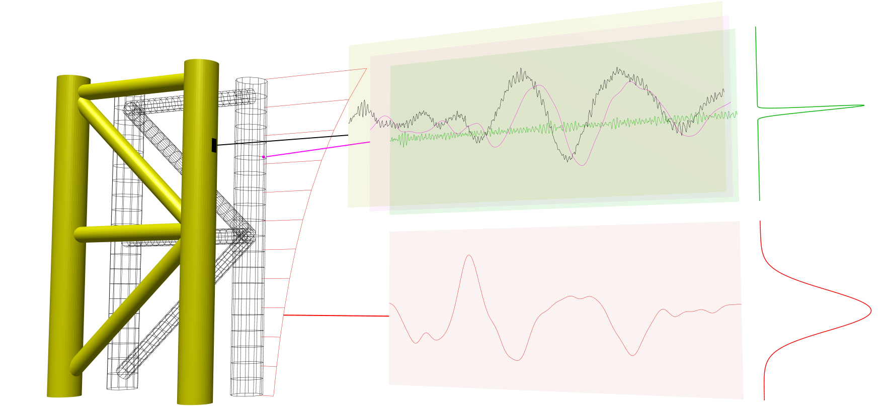
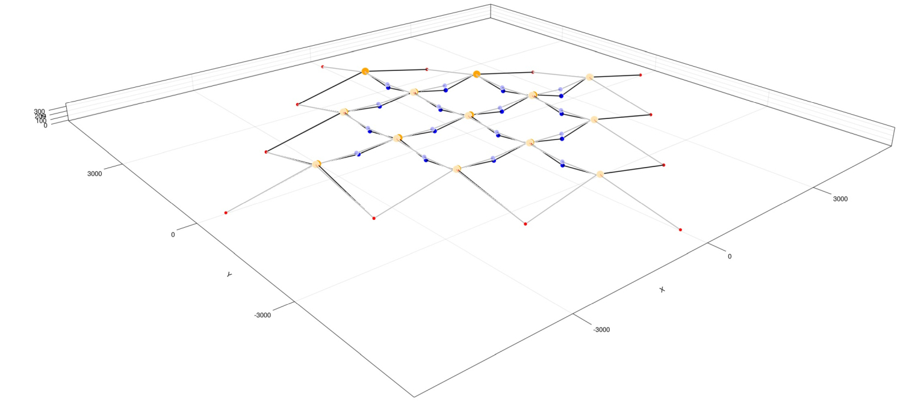

```@meta
CurrentModule = Muscade
```

# [Introduction](@id purpose)

## FEM-optimization problems

**[Muscade.jl](https://github.com/SINTEF/Muscade.jl) is a [Julia](https://julialang.org) package for the description and solution of optimization problems constrained by the equilibrium of a finite element (FEM) model.**  The mathematical problems solved by `Muscade` are defined by two components:

1) A fairly classical FEM model (the constraints) - but with more *degrees of freedom* (refered to as "dofs" in the following) than usual: In `Muscade`, dofs are separated into three `classes`:

   1. `X`-dofs are the classical dofs of a finite element model. To each `X`-dofs corresponds one equilibrium equation of the FEM model (duality). 
   2. `U`-dofs typicaly represent unknown external loads acting on the system, that vary with time.
   3. `A`-dofs typicaly represent unknown model parameters or design parameters that remain constant in time.

2) A "target" function of the above dofs.  It can represent a cost to be minimized, or a probability to be maximized.  This function is necessary because the FEM model alone has more unknowns that it has equations (a form of ill-posedness).

`Muscade` deals with static problems (FEM-equilibrium at a given time, and a target function that depends on the values of the dofs at that time), and dynamic problems (FEM-equilibrium at all time steps, and a target function that depends on the values, of derivatives, of the dofs at all time steps).

## Applications

FEM-optimization problems include a variety of applications:

**Load identification and monitoring**: Given incomplete and noisy measurements of the response `X` of a system, what are the loads `U` that are most likely to have caused a response close to what has been measured?  The target function describes prior knowledge of the load processes, and the type, value and precision of the measurements. 



*Conceptual representation of load identification and response monitoring. `U`-dof in red `X`-dof in magenta, measurement data in black and evaluated measurement (not a `Muscade` analysis output)in green. The figure is not a `Muscade` analysis output.*

**Model identification**: Adjust the model parameters `A` of a system (model calibration, damage detection) given measurements on its response `X` when exposed to at least partly unknown (`U`) load. As in load identification problems, the target function describes prior knowledge of the load processes, and the measurements.  In addition, it expresses prior knowledge of the state of the structure. 


*A small-scale physical model of an anchored vessel is "kicked" in an ocean laboratory, and the vessel's oscillations registrered. The graph shows the identification, using `Muscade`, of the system's non-linear added mass, damping and stiffness for surge (oscillation in forward direction). The actual analysis also captures the interaction with other degrees of freedom (sway and yaw).* 

**Design optimization**: What is the cheapest way to engineer a system whose strength is described by `A`, that will survive a set of loading conditions?  The target function describes a financial cost.



*Static optimisation of a shared anchor system for a lattice of offshore wind turbines.*

**Reliability analysis**: Finding a design point. What is the most probable combination of external loads `U` and strength of the structure `A` that may cause the response `X` to exceed, in one of many ways, an acceptable limit? Here the target function in the optimization problem describes the probability density (or rather, its logarithm) of unknown loads and strength parameters.

**Optimal control**: how to steer (`U`) a system with many dofs (`X`) to follow a target trajectory? The target function describes the cost of actuation and the cost of deviation from a target behaviour.

## `Muscade` and Lagrange multipliers

There are two general approaches to constrained optimization problems.

The first is a **change of variables** to eliminate the constraints.  In FEM-optimization, the FEM model is used to express the response as a function of unknow loads and/or model parameters.  This in turn allows to reexpress the target function in terms of unknow loads and/or model parameters: we now have an unconstrained optimization problem. One advantage of this approach is that it can be implemented using *existing* FEM software: The FEM software  is evaluated repeatedly by an optimization algorithm (FEM in the loop).  Such an implementation is useful in many applications, but it does not scale well to large numbers of parameters to optimize.  For example, this is not a good solution to identify the load history that must have acted on a dynamic structure to cause the response that has been partialy measured.

The second approach to constrained optimization is to use **Lagrange multipliers** (also known in this context as adjoint state variables).  This approach requires dedicated solvers, and dedicated systems for the assembly of gradient vectors and Hessian matrices. `Muscade` provides such solvers (and more are to be added in the near future).  The "Lagrange multiplier"-approach also requires that elements provide partial derivatives and internal results to the solution algorithms, in a way that is not easily achievable within the architecture of existing FEM software. As a consequence, in `Muscade`, all element types required to model a given physical system need to be reimplemented, which is a serious drawback.  However, thanks to careful design of `Muscade`, as well as to the capabilities provided by the [Julia](https://julialang.org) programming language, implementing elements is significantly easier than it would be within a classical FE software.

## Elements in `Muscade`

`Muscade` provides an API to create new elements. While `Muscade` comes with a few elements built-in elements for generic tasks such as applying boundary conditions, the idea is to support users in developing their own element formulations and implementations.   

`Muscade` inherently supports the developement of multiphysics model:  Elements can introduce new *fields* (new types of degrees of freedom: displacement, temperature, chemical species concentration, electric potential...). Elements that model the physics of a problem require the implementation of a function ([`Muscade.residual`](@ref)) that, given degrees of freedom, returns the element's contribution to the residual of the discretized equations to be solved, representing for example dynamic equilibrium. 

Elements are also used to implement constraints, or, for example, measurements: given degrees of freedom, such an element returns the logarithm of the probability of this combination of degrees of freedom, given the measured data ([`Muscade.lagrangian`](@ref)).  See [`Implementing new elements`](@ref implementelement) for more details.

`Muscade` makes it easier to develop new element types by applying several techniques:

**[Automatic differentiation](Adiff.md)**: elements describing a physical phenomena need only return the contribution of the element to the residual of the equations.  Elements describing a contribution to the target function do not need to provide gradient or Hessian. Automatic differentiation allows to efficiently compute the partial derivatives required by the solver *without changes tot he element code*

**[Automatic extraction of element-results](@ref espy)**: "Element-results" are intermediate results evaluated in the process of computing contributions to the residual from degrees of freedom. An example is stresses and strains, in an element that given nodal displacements computes nodal forces. To make an element-result available, the only requirement is to prefix it with a `☼` (special character `\sun`) in the code of [`Muscade.residual`](@ref) or [`Muscade.lagrangian`](@ref).  For example: `☼σ = E*ε`.  This automatic result extraction also makes it possible to describe measurements taken on element-results (for example a strain).

**Element [constructor](@ref constructor) for modeling**: Models in `Muscade` are created by writing Julia code that among other things, constructs new element instances.  Thanks to this, an element constructor is all that is required of the element programmer to make it available to the user that is modeling a physical system.

!!! info
    `Muscade.jl` is under development: 
    - Functionality 
    - Solvers
    - Testing 
    - Documentation
    - Performance
    are all work in progress, and APIs may still evolve.


